
```mermaid
flowchart TD

%% =====================================================================
%% Parte 5 - Modelo ERE del Proyecto Asignado
%% Obra Pública Municipal de Temascaltepec - PublicMunicipalWorks_DWH
%% Notación: Peter Chen
%% =====================================================================


%% === Entidades fuertes ===
Obra[OBRA]
Region[REGIÓN]
Constructora[CONSTRUCTORA]
Fuente[FUENTE PRESUPUESTARIA]
Personal[PERSONAL MUNICIPAL]
Poblador[POBLADOR]
Propuesta[PROPUESTA DE OBRA]

%% === Subtipos de Personal ===
Supervisor[SUPERVISOR]
Proyectista[PROYECTISTA]

%% === Entidades débiles ===
Presupuesto[PRESUPUESTO]:::debil
Costo[COSTO]:::debil
Informe[INFORME DE AVANCE]:::debil
Imagen[EVIDENCIA FOTOGRÁFICA]:::debil
Acta[ACTA DE ENTREGA]:::debil
Firmante[FIRMANTE]:::debil
Permiso[PERMISO]:::debil

%% =====================================================================
%% Jerarquía de generalización / especialización
%% =====================================================================

Personal --- Especializacion((d))
Especializacion --- Supervisor
Especializacion --- Proyectista

%% =====================================================================
%% Atributos
%% =====================================================================

%% --- Obra ---
Obra_Id([<u>Identificador de obra]) --- Obra
Obra_Exp([<u>Código de expediente]) --- Obra
Obra_Nombre([Nombre de la obra]) --- Obra
Obra_Desc([Descripción]) --- Obra
Obra_Etapa([Etapa]) --- Obra
Obra_Benef([Beneficiarios]) --- Obra
Obra_Estado([Estado]) --- Obra
Obra_Periodo([Periodo de ejecución]) --- Obra
Obra_Periodo --- Obra_Inicio([Fecha de inicio])
Obra_Periodo --- Obra_Fin([Fecha de término])

%% --- Región ---
Region_Id([<u>Identificador de región]) --- Region
Region_Ubic([Ubicación]) --- Region
Region_Ubic --- Region_Com([Comunidad])
Region_Ubic --- Region_Barrio([Barrio])
Region_Ubic --- Region_Col([Colonia])

%% --- Constructora ---
Const_Id([<u>Identificador]) --- Constructora
Const_Rfc([RFC]) --- Constructora
Const_Nombre([Razón social]) --- Constructora
Const_Tipo([Tipo de ejecutor]) --- Constructora

%% --- Fuente presupuestaria ---
Fuente_Id([<u>Identificador de fuente]) --- Fuente
Fuente_Grado([Grado o nivel de gobierno]) --- Fuente
Fuente_Prog([Programa]) --- Fuente

%% --- Personal municipal ---
Pers_Cod([<u>Código de personal]) --- Personal
Pers_Rol([Rol]) --- Personal
Pers_Nombre([Nombre completo]) --- Personal
Pers_Nombre --- Pers_Pila([Nombre de pila])
Pers_Nombre --- Pers_Pat([Apellido paterno])
Pers_Nombre --- Pers_Mat([Apellido materno])

%% Atributos propios de cada subtipo
Sup_Tel([Teléfono]) --- Supervisor
Sup_Obras([Número de obras asignadas]) --- Supervisor
Proy_Empresa([Empresa]) --- Proyectista
Proy_Ced([Constructora de adscripción]) --- Proyectista

%% --- Poblador ---
Pob_Curp([<u>CURP]) --- Poblador
Pob_Nombre([Nombre completo]) --- Poblador
Pob_Com([Comunidad de residencia]) --- Poblador
Pob_Alta([Fecha de registro]) --- Poblador

%% --- Propuesta de obra ---
Prop_Id([<u>Folio de propuesta]) --- Propuesta
Prop_Tit([Título]) --- Propuesta
Prop_Desc([Descripción de la obra]) --- Propuesta
Prop_Benef([Descripción de beneficiados]) --- Propuesta
Prop_Pros([Beneficios para la comunidad]) --- Propuesta
Prop_Anio([Año de convocatoria]) --- Propuesta
Prop_Votos([Total de votos]) --- Propuesta

%% --- Presupuesto  débil, dependencia de existencia ---
Pres_Id([<i>Identificador de presupuesto]) --- Presupuesto
Pres_Total([Monto total]) --- Presupuesto

%% --- Costo  débil, dependencia de identificación ---
Costo_Id([<i>Número de partida]) --- Costo
Costo_Cat([Categoría]) --- Costo
Costo_Monto([Monto]) --- Costo
Costo_Desc([Descripción]) --- Costo

%% --- Informe de avance  débil, dependencia de identificación ---
Inf_Mes([<i>Mes]) --- Informe
Inf_Anio([<i>Año]) --- Informe
Inf_Fis([Porcentaje de avance físico]) --- Informe
Inf_Pre([Porcentaje de avance presupuestario]) --- Informe
Inf_Doc([Documento del informe]) --- Informe
Inf_Desc([Descripción]) --- Informe

%% --- Evidencia fotográfica  débil, dependencia de existencia ---
Img_Id([<i>Identificador de imagen]) --- Imagen
Img_Url([Ubicación del archivo]) --- Imagen
Img_Nombre([Nombre original]) --- Imagen
Img_Tipo([Tipo de archivo]) --- Imagen
Img_Fecha([Fecha de carga]) --- Imagen

%% --- Acta de entrega  débil, dependencia de existencia ---
Acta_Id([<i>Número de acta]) --- Acta
Acta_Doc([Documento del acta]) --- Acta
Acta_Fecha([Fecha de expedición]) --- Acta

%% --- Firmante  débil, dependencia de identificación ---
Firm_Id([<i>Identificador de firmante]) --- Firmante
Firm_Nombre([Nombre completo]) --- Firmante
Firm_Cargo([Cargo]) --- Firmante

%% --- Permiso  débil, dependencia de existencia ---
Perm_Id([<i>Número de oficio]) --- Permiso
Perm_Inst([Instancia que lo emite]) --- Permiso
Perm_Doc([Oficio de acreditación]) --- Permiso

%% =====================================================================
%% Relaciones
%% =====================================================================

%% --- Obra con su contexto territorial, ejecutor y supervisión ---
Obra -- "(1,1)" --- RelUbica{Se ubica en} -- "(0,N)" --- Region
Obra -- "(1,1)" --- RelEjecuta{Ejecuta} -- "(0,N)" --- Constructora
Obra -- "(1,1)" --- RelSupervisa{Supervisa} -- "(0,N)" --- Supervisor

%% --- Financiamiento  N a M con varias fuentes concurrentes ---
Obra -- "(1,N)" --- RelFinancia{Financia} -- "(0,N)" --- Fuente

%% --- Proceso de selección del ejecutor ---
%% Relación con atributos propios: registra a cada constructora que
%% concursó, si fue aprobada y las razones de la decisión.
Obra -- "(0,N)" --- RelConcursa{Concursa por} -- "(0,N)" --- Constructora
RelConcursa --- Conc_Aprob([Aprobado])
RelConcursa --- Conc_Raz([Razones de la decisión])

%% --- Presupuesto y su desglose ---
Obra == "(1,1)" === RelPresupuesta{Se presupuesta en} == "(0,1)" === Presupuesto
Presupuesto -- "(1,1)" --- RelElabora{Elabora} -- "(0,N)" --- Proyectista
Presupuesto == "(1,N)" === RelDesglosa{Se desglosa en} == "(1,1)" === Costo

%% --- Seguimiento mensual del avance ---
Obra == "(0,N)" === RelReporta{Se reporta en} == "(1,1)" === Informe
Informe -- "(1,1)" --- RelLevanta{Levanta} -- "(0,N)" --- Supervisor
Informe == "(0,N)" === RelDocumenta{Se documenta con} == "(1,1)" === Imagen

%% --- Cierre administrativo de la obra ---
Obra == "(0,1)" === RelCierra{Se cierra con} == "(1,1)" === Acta
Acta == "(1,N)" === RelFirma{Es firmada por} == "(1,1)" === Firmante

%% --- Permisos y acreditaciones ---
Obra == "(0,N)" === RelRequiere{Requiere} == "(1,1)" === Permiso

%% --- Participación ciudadana ---
Poblador -- "(0,N)" --- RelPropone{Propone} -- "(1,1)" --- Propuesta
Poblador -- "(0,N)" --- RelVota{Vota por} -- "(0,N)" --- Propuesta
RelVota --- Voto_Periodo([Periodo de votación])
RelVota --- Voto_Fecha([Fecha del voto])

%% --- Enlace propuesta - obra ---
%% ⚠ Existe en el dominio pero NO en el esquema publicado: la tabla
%% propuestas_obras no tiene llave foránea hacia obra, así que la
%% trazabilidad entre lo que pide la ciudadanía y lo que se construye
%% se pierde al pasar al esquema relacional.
Propuesta -. "(0,1)" .- RelOrigina{Da origen a} -. "(0,1)" .- Obra

%% =====================================================================
%% Estilos
%% Paleta validada para deficiencia de color y contraste en tema claro y
%% oscuro. Color redundante con la forma: azul entidades, naranja
%% relaciones, verde atributos.
%% =====================================================================

classDef default        fill:#e3f6ee,stroke:#1baf7a,color:#1a1a19
classDef entidad        fill:#e7f0fb,stroke:#2a78d6,color:#1a1a19
classDef debil          fill:#e7f0fb,stroke:#2a78d6,color:#1a1a19,stroke-width:4px
classDef relacion       fill:#fdeae1,stroke:#eb6834,color:#1a1a19
classDef identificadora fill:#fdeae1,stroke:#eb6834,color:#1a1a19,stroke-width:4px
classDef ausente        fill:#fdeae1,stroke:#eb6834,color:#1a1a19,stroke-dasharray: 5 5
classDef jerarquia      fill:#eeeeec,stroke:#52514e,color:#1a1a19,stroke-width:4px

class Obra,Region,Constructora,Fuente,Personal,Poblador,Propuesta,Supervisor,Proyectista entidad
class RelUbica,RelEjecuta,RelSupervisa,RelFinancia,RelConcursa,RelElabora,RelLevanta,RelPropone,RelVota relacion
class RelPresupuesta,RelDesglosa,RelReporta,RelDocumenta,RelCierra,RelFirma,RelRequiere identificadora
class RelOrigina ausente

%% naranja = relaciones · verde = atributos · gris = jerarquia
%% naranja discontinuo = relacion del dominio ausente en el esquema publicado
linkStyle 72,73,74,75,76,77,78,79,80,81,84,85,86,87,88,89,90,91,92,93,94,95,96,97,98,99,100,101,102,103,104,105 stroke:#eb6834,stroke-width:2px
linkStyle 3,4,5,6,7,8,9,10,11,12,13,14,15,16,17,18,19,20,21,22,23,24,25,26,27,28,29,30,31,32,33,34,35,36,37,38,39,40,41,42,43,44,45,46,47,48,49,50,51,52,53,54,55,56,57,58,59,60,61,62,63,64,65,66,67,68,69,70,71,82,83,106,107 stroke:#1baf7a,stroke-width:1px
linkStyle 0,1,2 stroke:#52514e,stroke-width:2px
linkStyle 108,109 stroke:#eb6834,stroke-width:2px,stroke-dasharray: 5 5
```

# Modelo ERE del Proyecto Asignado

---

## De dónde se reconstruyó el modelo

El repositorio publica dos esquemas distintos y es importante aclarar de cuál se partió, porque la práctica pide explícitamente no copiar el esquema en estrella.

El primero es el **esquema operativo** (`db/DDLBASEObPub.sql`), que es el que usa la aplicación web para capturar la información del día a día: quién dio de alta una obra, qué presupuesto se le asignó, qué informes de avance subió el supervisor. El segundo es el **almacén dimensional** (`db/arquitectura/ESQUEMA DEL DATA WAREHOUSE.sql`), con sus `warehouse.dim_*` y `warehouse.fact_*`, que se llena solo mediante triggers de SQL cada vez que se inserta o modifica algo en el operativo.

El almacén dimensional no describe el dominio sino que lo reorganiza para que las consultas de análisis sean rápidas, entonces cosas como `dim_tiempo` o las columnas de versionado `es_actual` y `fecha_expiracion` no corresponden a ningún objeto de la realidad del municipio sino a decisiones de cómo guardar el historial. Por eso el modelo conceptual se reconstruyó desde el **esquema operativo** y desde lo que describe el artículo, y el dimensional se usó solamente para la tabla de correspondencia.

---

## El modelo

Código fuente del diagrama (Mermaid)

---

## Jerarquía y entidades débiles del dominio

La práctica pide identificar al menos una jerarquía o una entidad débil, y en este dominio existen las dos.

### La jerarquía: PERSONAL MUNICIPAL

La tabla `personal` guarda un atributo `rol`, pero además existen dos tablas aparte, `supervisor` y `proyectista`, que tienen como clave el mismo `codigo_personal` y le agregan atributos propios. El supervisor guarda su teléfono y el proyectista guarda la empresa y la constructora a la que está adscrito, entonces no es un simple atributo de clasificación sino una especialización real, porque cada subtipo tiene atributos que no aplican al otro y participa en relaciones distintas: el supervisor supervisa obras y levanta informes, el proyectista elabora presupuestos.

La jerarquía quedó **disjunta y parcial**. Es disjunta porque el atributo `rol` admite un solo valor por persona, y es parcial porque los otros roles que maneja el sistema, como director o secretario, existen en `personal` pero no tienen tabla propia ni atributos que los distingan, entonces hay personal municipal que no cae en ninguno de los dos subtipos.

### Las entidades débiles

Siete entidades del dominio no pueden existir sin la obra o sin su contenedor:

| Entidad | Depende de | Tipo de dependencia |
| :-- | :-- | :-- |
| PRESUPUESTO | OBRA | Existencia |
| COSTO | PRESUPUESTO | Identificación |
| INFORME DE AVANCE | OBRA | Identificación |
| EVIDENCIA FOTOGRÁFICA | INFORME | Existencia |
| ACTA DE ENTREGA | OBRA | Existencia |
| FIRMANTE | ACTA | Identificación |
| PERMISO | OBRA | Existencia |

El caso más claro es el informe de avance, porque en el dominio se identifica por la obra más el mes y el año que reporta, entonces decir "el informe de marzo" no significa nada si no se dice de qué obra. Lo mismo pasa con el costo, que es una partida dentro de un presupuesto, y con el firmante, que solo existe como firmante de un acta en concreto.

Las de existencia son distintas porque sí tienen identidad propia pero no pueden existir sueltas: un presupuesto o un acta de entrega sin obra no significan nada, y el esquema lo confirma con un `UNIQUE` sobre `id_obra` en `presupuesto_obra` y en `acta_entrega`, que es lo que vuelve esas relaciones uno a uno.

---

## Tabla de correspondencia

| Entidad del modelo | Esquema operativo | Esquema dimensional |
| :-- | :-- | :-- |
| OBRA | `public.obra` | `warehouse.dim_obra` |
| REGIÓN | `public.region` | `warehouse.dim_region` |
| CONSTRUCTORA | `public.constructora` | `warehouse.dim_constructora` |
| FUENTE PRESUPUESTARIA | `public.fuente_presupuestaria` + `public.financia` | `warehouse.dim_fuente` |
| PERSONAL MUNICIPAL | `public.personal` | `warehouse.dim_personal` |
| SUPERVISOR | `public.supervisor` | *dentro de* `dim_personal` |
| PROYECTISTA | `public.proyectista` | *dentro de* `dim_personal` |
| POBLADOR | `public.pobladores` | `warehouse.dim_poblador` |
| PROPUESTA DE OBRA | `public.propuestas_obras` | `warehouse.dim_propuesta` |
| *relación Vota por* | `public.votos_propuestas` | — |
| *relación Concursa por* | `public.opcion_seleccion` | — |
| PRESUPUESTO | `public.presupuesto_obra` | `warehouse.dim_presupuesto` |
| COSTO | `public.costos` | — |
| INFORME DE AVANCE | `public.informes` | `warehouse.fact_obra_mensual` |
| EVIDENCIA FOTOGRÁFICA | `public.imagenes_informe` | — |
| ACTA DE ENTREGA | `public.acta_entrega` | — |
| FIRMANTE | `public.firmantes` | — |
| PERMISO | `public.permisos` | — |
| — | — | `warehouse.dim_tiempo` |
| — | — | `warehouse.dim_tipo_evento` |
| — | — | `warehouse.fact_eventos_auditoria` |

---

## Qué se pierde y qué se agrega

### Lo que se pierde al pasar al esquema dimensional

**Todo el cierre administrativo de la obra desaparece.** Costo, evidencia fotográfica, acta de entrega, firmante y permiso no tienen dimensión ni hecho propio, entonces del detalle de en qué se gastó el presupuesto solo sobrevive el `costo_acumulado` de `fact_obra_mensual`, y de las actas y los permisos solo queda el conteo `permisos_obtenidos`. Quien consulte únicamente el almacén no puede saber quién firmó el acta de una obra ni qué instancia emitió un permiso.

**Los dos subtipos se aplanan.** Supervisor y proyectista se absorben en `dim_personal`, entonces se pierde la jerarquía: en el almacén un proyectista y un supervisor se ven igual salvo por el valor de un campo, y los atributos propios de cada uno ya no están.

**Las relaciones con atributos se vuelven tablas sin voz.** `opcion_seleccion` guarda qué constructoras concursaron por una obra, si fueron aprobadas y las razones de la decisión, que es información del proceso de selección, y esa tabla no se refleja en ninguna dimensión.

### Lo que se agrega

**El versionado.** `dim_obra` trae `fecha_efectiva`, `fecha_expiracion`, `es_actual` y `motivo_cambio`, que no son datos de la obra sino la maquinaria para conservar el historial de cambios. El dominio no tiene ese concepto.

**Las métricas calculadas.** `fact_obra_mensual` agrega `saldo_presupuesto`, `porcentaje_ejercido`, `dias_retraso`, `tiene_retraso` y `tiene_alertas`, que son derivados de los datos operativos y no existen como tales en la realidad del municipio.

**Las dimensiones de puro análisis.** `dim_tiempo` y `dim_tipo_evento` junto con `fact_eventos_auditoria` no corresponden a objetos del dominio sino a la bitácora que generan los triggers y al calendario que necesita el esquema en estrella para agrupar por periodo.
